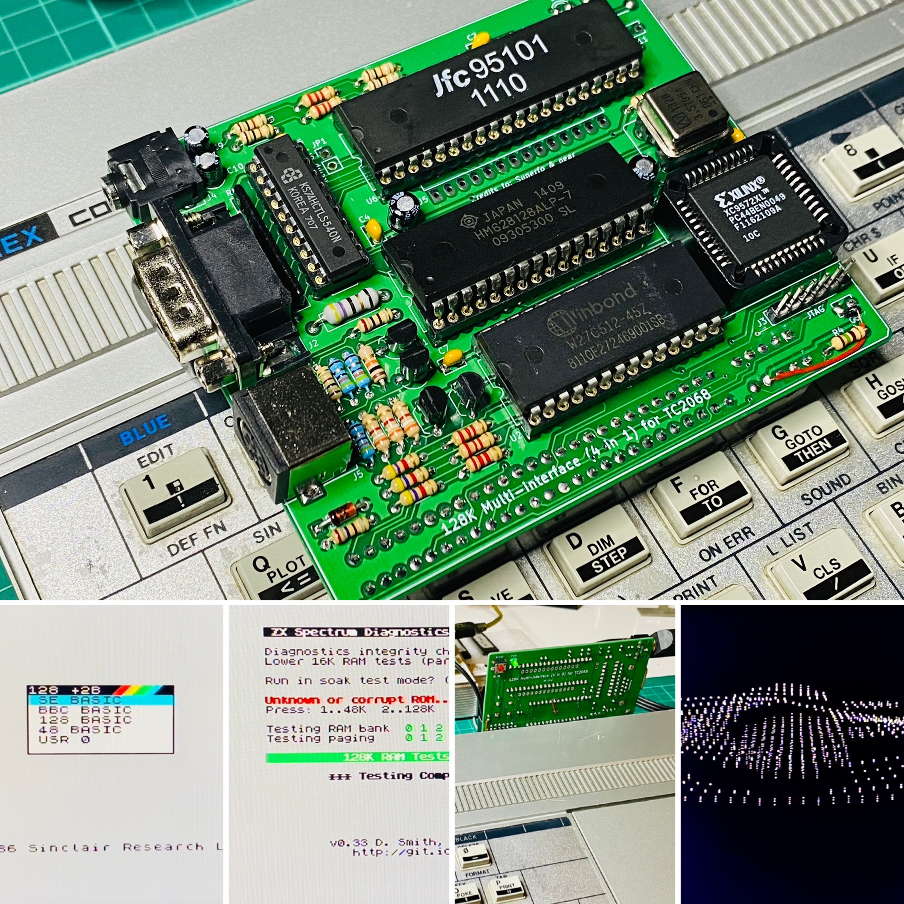

# 128K expantion for Timex Computer 2068

© 2022 KWF

Date: 01/02/2022

Revision: 0.2

#### Embeded features:

* 2 x 32KB ROM,
* 128 KB RAM with ZX Spectrum +2A/B & +3 paging modes,
* control logic in CPLD (XC9536XL type)
* AY-3-8910 sound chip controlled with ZX128K ports,
* Kempston joystick interface,
* RGB video outputs,
* RESET button.

If you are interested in hardware tests watch my [YouTube Channel](https://youtu.be/7duh5zHNvDc)

### Photos

Prototype board

### Warranty

*No Warranty of the Project. The Issuer makes no express or implied warranty of any kind whatsoever with respect to the Project.*

### License

GNU General Public License v3.0 T&C applies to this repository content.
